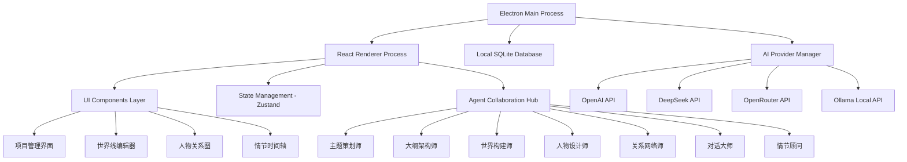

# 规划蓝图：AI辅助小说创作应用开发
*   **状态**: [规划中]

## 1. 核心目标与验收标准 (Core Objective & Acceptance Criteria)

### a. 核心目标 (Core Objective)
*   构建一个基于多智能体协作的跨平台小说创作辅助应用，通过集成多个大模型API，为作者提供从构思到完成的全流程专业创作支持，实现"AI赋能创作者"的核心价值。

### b. 验收标准 (Acceptance Criteria)
*   `[ ]` 应用能在macOS、Windows、Linux三个平台正常启动和运行
*   `[ ]` 成功集成DeepSeek、Ollama、OpenRouter、OpenAI四个AI模型API接口
*   `[ ]` 实现7个专业智能体：主题策划师、大纲架构师、世界构建师、人物设计师、关系网络师、对话大师、情节顾问
*   `[ ]` 智能体间能够共享项目上下文，实现协作式创作建议
*   `[ ]` 用户可以创建新的小说项目，并通过可视化界面管理所有创作要素
*   `[ ]` 提供丰富的交互界面：世界线编辑器、人物关系图、情节时间轴、角色档案管理
*   `[ ]` 所有用户数据本地存储，保护创作隐私
*   `[ ]` 应用支持离线模式（使用本地Ollama模型时）
*   `[ ]` 完整的项目导出功能（Markdown、Word、PDF格式）

## 2. 现状分析与复用性尽职调查 (Current State Analysis & Reuse Due Diligence)

### a. 复用性尽职调查
*   **搜索关键词**: `electron`, `ai writing`, `novel assistant`, `multi-agent`, `cross-platform writing`
*   **搜索范围**: 当前工作目录为空项目，无现有代码可复用
*   **发现与结论**:
    *   项目从零开始，无现有代码库
    *   技术栈选择基于跨平台需求和AI集成便利性
    *   **结论**: 需要完全新建项目架构，但可参考成熟的Electron + React最佳实践

### b. 潜在影响分析
*   本项目涉及多个AI API的集成，需要考虑API调用频率限制和成本控制
*   跨平台兼容性需要在文件系统、路径处理、系统通知等方面特别注意
*   本地数据库设计需要支持复杂的创作数据结构和关系
*   AI模型响应的异步处理和用户体验优化是关键挑战

## 3. 技术方案与架构设计 (Technical Approach & Architecture Design)

### a. 技术栈架构
*   **前端框架**: 
    *   Electron (跨平台桌面应用框架)
    *   React 18 + TypeScript (用户界面开发)
    *   Material-UI (统一的UI组件库)
    *   Zustand (轻量级状态管理)
    *   React Router (页面路由管理)

*   **后端服务**:
    *   Node.js + Express (本地API服务)
    *   Better-SQLite3 (本地数据库)
    *   Electron Store (配置和设置存储)

*   **AI集成层**:
    *   统一的AI Provider接口设计
    *   支持OpenAI、DeepSeek、OpenRouter的HTTP API
    *   支持Ollama的本地API调用
    *   智能体上下文管理和记忆系统

### b. 核心架构设计

### c. 数据模型设计
*   **项目表 (Projects)**: 存储小说项目基本信息
*   **章节表 (Chapters)**: 管理小说章节结构
*   **角色表 (Characters)**: 详细的人物档案信息
*   **世界观表 (WorldBuilding)**: 世界设定和背景信息
*   **关系表 (Relationships)**: 人物间的复杂关系网络
*   **对话历史表 (AgentConversations)**: 智能体交互记录
*   **创作会话表 (WritingSessions)**: 用户创作过程追踪

## 4. 任务分解与上下文锚点 (Task Breakdown & Context Anchors)

### 里程碑1: 项目基础架构搭建 (状态: `已完成`)
*   `[x]` 1.1: 创建项目目录结构和配置文件
*   `[x]` 1.2: 配置Webpack构建系统和开发环境
*   `[x]` 1.3: 实现Electron主进程基础框架
*   `[x]` 1.4: 创建React渲染进程基础结构
*   `[x]` 1.5: **验证点** - 基础架构代码完成，待Node.js环境安装后验证启动

### 里程碑2: 数据层和AI集成 (状态: `已完成`)
*   `[x]` 2.1: 设计并实现SQLite数据库模型
*   `[x]` 2.2: 创建统一的AI Provider接口
*   `[x]` 2.3: 集成四个AI模型API (OpenAI, DeepSeek, OpenRouter, Ollama)
*   `[x]` 2.4: 实现AI调用的错误处理和重试机制
*   `[x]` 2.5: **验证点** - AI服务层完成，待Node.js环境测试API调用

### 里程碑3: 智能体系统实现 (状态: `已完成`)
*   `[x]` 3.1: 设计智能体基础类和协作框架
*   `[x]` 3.2: 实现主题策划师和大纲架构师
*   `[x]` 3.3: 实现世界构建师和人物设计师
*   `[x]` 3.4: 实现关系网络师、对话大师和情节顾问
*   `[x]` 3.5: 构建智能体间的上下文共享机制
*   `[x]` 3.6: **验证点** - 7个专业智能体系统完成，待Node.js环境测试协作功能

### 里程碑4: 用户界面开发 (状态: `已完成`)
*   `[x]` 4.1: 实现项目管理和导航界面
*   `[x]` 4.2: 开发智能体交互界面和聊天组件
*   `[x]` 4.3: 创建项目详情页面和标签页导航
*   `[x]` 4.4: 构建智能体面板和状态管理
*   `[x]` 4.5: 实现项目卡片和对话框组件
*   `[x]` 4.6: **验证点** - 完整的用户界面框架完成，支持项目管理和AI交互

### 里程碑5: 高级功能和优化 (状态: `未开始`)
*   `[ ]` 5.1: 实现项目导出功能 (Markdown, Word, PDF)
*   `[ ]` 5.2: 添加创作进度追踪和统计
*   `[ ]` 5.3: 优化AI响应速度和用户体验
*   `[ ]` 5.4: 实现应用设置和个性化配置
*   `[ ]` 5.5: **验证点** - 完整功能测试和性能优化

### 里程碑6: 跨平台测试和发布 (状态: `未开始`)
*   `[ ]` 6.1: 在三个平台进行完整功能测试
*   `[ ]` 6.2: 优化应用启动速度和资源占用
*   `[ ]` 6.3: 配置自动更新机制
*   `[ ]` 6.4: 准备应用分发包
*   `[ ]` 6.5: **验证点** - 应用在所有目标平台稳定运行

## 5. 风险评估与应对策略 (Risk Assessment & Mitigation Plan)

### 技术风险
*   **风险1**: AI API调用频率限制和成本控制
    *   **应对**: 实现本地缓存机制，优化API调用策略，提供成本预估功能
*   **风险2**: 跨平台兼容性问题
    *   **应对**: 在开发早期就在三个平台进行测试，使用成熟的跨平台库
*   **风险3**: 大型项目的数据库性能
    *   **应对**: 优化数据库索引，实现数据分页和懒加载

### 产品风险
*   **风险4**: 用户学习成本过高
    *   **应对**: 设计直观的用户界面，提供详细的使用指南和示例项目
*   **风险5**: AI生成内容质量不稳定
    *   **应对**: 实现多模型对比，允许用户选择和调整AI建议

### 开发风险
*   **风险6**: 项目复杂度导致开发周期延长
    *   **应对**: 严格按照里程碑进行开发，优先实现核心功能，后续迭代增加高级特性
